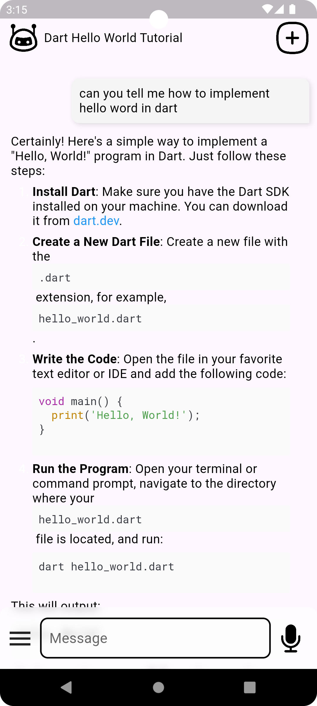
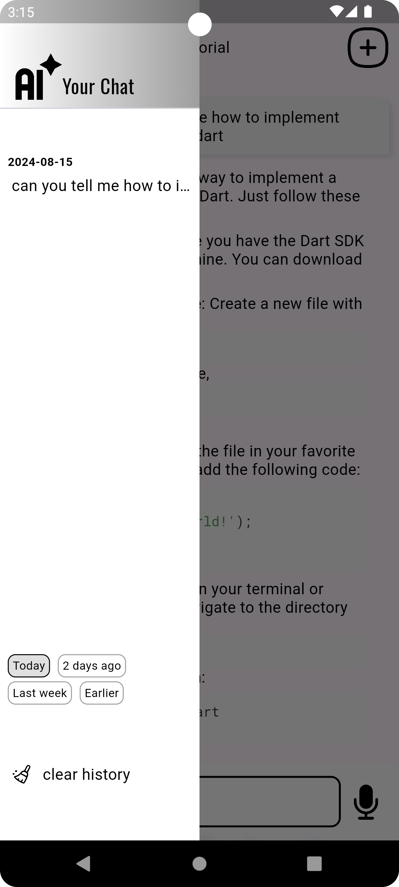
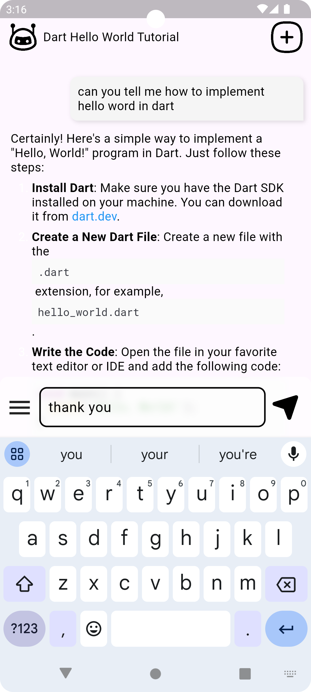

## A Flutter gpt chat demo.

**how to build it**:  
create a **.env** file in **root directory** with **OPENAI_API_KEY=your apiKey**

## Screenshots

|                                     |                                     |                                     |
|:-----------------------------------:|:-----------------------------------:|:-----------------------------------:|
|  |  |  |

